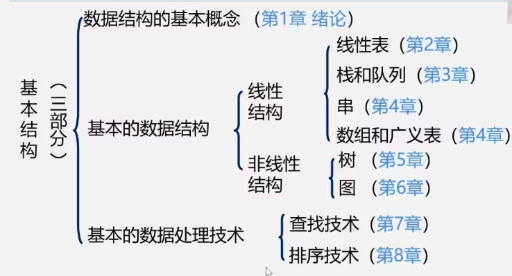
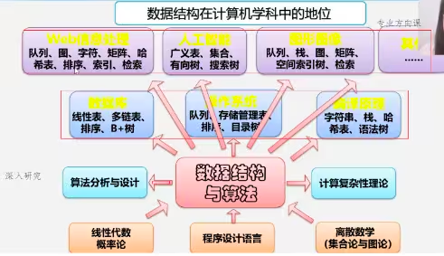

# wangzhuo

# 第一章 数据结构绪论

学习数据结构之前或许你会有这样的疑问：

- 这门课我们学什么？

- 这门课好学吗？

- 这门课怎么才能学好？

接下来我们就一一解答这些问题
```

Q1:这门课我们学什么？
```

凭借一句话获得图灵奖的Pascal语言之父——Nicklaus Wirth,让他获得图灵奖的这句话就是他提出的著名公式：
```
程序=数据结构+算法
```
这个公式对计算机科学的影响程度足以类似物理学中爱因斯坦的E=mc^2
——这个公式展示了程序的本质

算法其实就是用于解决某一类问题的公式与思想。（给出问题的数学模型）而数据结构就是数据的组织、管理和存储格式，其使用目的是为了高效的访问和修改数据。至于程序就是计算机处理问题的一系列指令。

程序设计的实质是对确定的问题选择一种好的数据结构，并设计一种好的算法。



- 数据结构是计算机软件相关专业的专业基础课

- 在教学计划中的地位 ：承上启下、核心部分 



- 数据结构是介于数学、计算机硬件和计算机软件之间的一门核心课程

